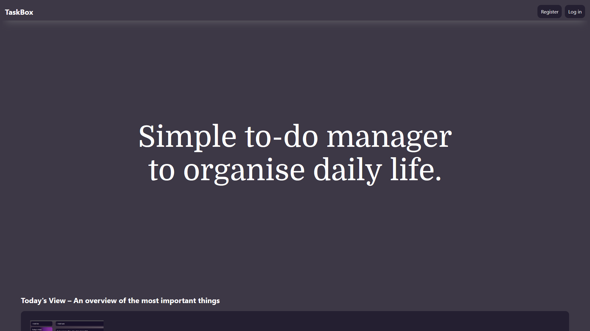

# 📝 TaskBox

**TaskBox** is simple and open to-do application for everyday oraganization. It offers a clean interface and easy access via web browser - on desktop and mobile.

## ✨ Funtions

- 🗂️ Sorting tasks into custom lists
- ✏️ Support for notes, subtasks, reminders and completion date
- 🗓️ **Today** section for a quick overview of current priorities
- 🌐 Web interface available on all devices
- 💾 Self-hosted application with full control over data

## 🚀 Screenshot

## 🔧 Technology

- HTML/CSS/JavaScript
- Fat Free Framework
  - bcosca/fatfree-core
  - ikkez/f3-cortex
  - ikkez/f-flash
  - ikkez/f-mailer

## 🤝 Přispívání

Contributions are welcome! Feel free to open an issue or pull request with a suggestion for improvements.

## 📄 Licence

GNU GPLv3 Licence – see [LICENSE](https://github.com/pisekpiskovec/TaskBox/blob/master/LICENSE.txt)

Release codenames and release tags are based on Project Moon's Abnormalities. More info about [Project Moon](https://projectmoon.studio/)

> [!WARNING]
> When forking, it is highly discouraged to name releases after Abnormalities.
